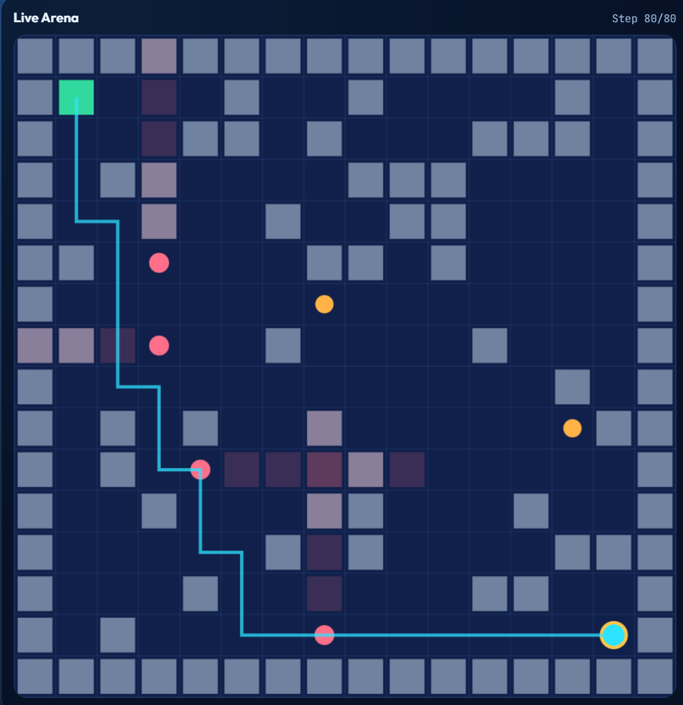

# Heist Architect v2 Workspace

Operational workspace for your Kaggle-trained Heist Architect v2 checkpoints.

## Start Here

1. Activate environment:

```bash
conda activate cv_conda
pip install -r requirements.txt
```

2. Validate local checkpoints:

```bash
python main.py list
python main.py test --episode ep17000
```

3. Launch interactive dashboard:

```bash
python main.py dashboard --host 127.0.0.1 --port 5000
```

Open `http://127.0.0.1:5000`.

## Documentation

- Theory and concepts (primary deep dive): [README_THEORY.md](README_THEORY.md)
- Training dynamics and checkpoint analysis: [README_TRAINING.md](README_TRAINING.md)
- Agent operating playbook: [agent.md](agent.md)

## Preview


