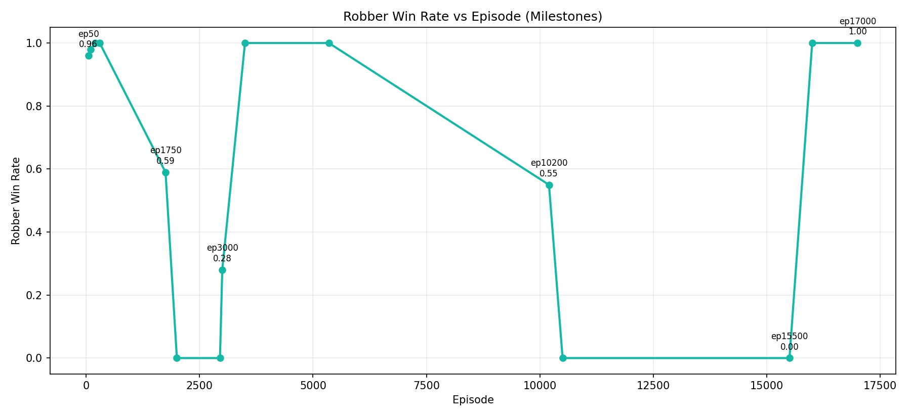
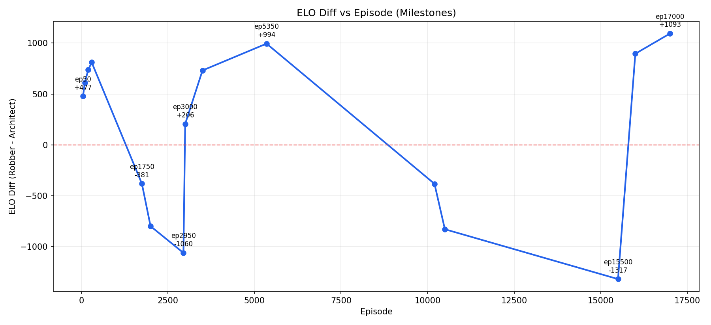

# Training Consolidated Report

Project context and architecture are documented in [README_DETAILED.md](README_DETAILED.md).

This document combines and replaces the previous training documents:
- `README_TRAINING_ANALYSIS.md`
- `README_TRAINING_CHECKPOINTS.md`
- `README_TRAINING_CHARTS.md`

It provides one unified narrative: analysis, timeline, and charts.

## Scope

Based on the provided long-form training history, this report summarizes visible milestones from episode 50 through episode 17000.

Observed characteristics:
- curriculum levels: Rookie, Intermediate, Expert, Master
- checkpoint cadence: every 500 episodes
- repeated adversarial dynamics with collapse/recovery cycles

## Executive Summary

The training trajectory follows a recurring pattern:

1. Early rapid solver dominance during curriculum climb.
2. Deep collapse regimes where robber win-rate drops to 0.00 for sustained windows.
3. Recovery regimes that restore and eventually exceed earlier performance.

Final visible endpoint:
- episode: 17000
- stage: Master
- robber win-rate: 1.00
- robber reward: +2.3
- architect reward: -2.3
- ELO diff: +1093

This supports using `ep17000` as the current default superior checkpoint.

## Key Milestones

| Episode | Stage | Robber Win | ELO Diff | Interpretation |
|---:|---|---:|---:|---|
| 50 | Rookie | 0.96 | +477 | Solver starts strong |
| 100 | Intermediate | 0.98 | +609 | Fast adaptation |
| 200 | Expert | 1.00 | +737 | Solver generalizes quickly |
| 300 | Master | 1.00 | +810 | Reaches hardest curriculum |
| 1750 | Master | 0.59 | -381 | First collapse begins |
| 2000 | Master | 0.00 | -798 | Collapse deepens |
| 2950 | Master | 0.00 | -1060 | First collapse low point |
| 3000 | Master | 0.28 | +206 | Recovery begins |
| 3500 | Master | 1.00 | +731 | Recovery stabilizes |
| 5350 | Master | 1.00 | +994 | High-performance peak |
| 10200 | Master | 0.55 | -382 | Second collapse begins |
| 10500 | Master | 0.00 | -828 | Second collapse deepens |
| 15500 | Master | 0.00 | -1317 | Deepest visible valley |
| 16000 | Master | 1.00 | +895 | Recovery after restart |
| 17000 | Master | 1.00 | +1093 | Best visible endpoint |

## Phase-by-Phase Dynamics

### Phase A: Curriculum acceleration (50 to 1700)
- transitions from Rookie to Master quickly
- robber win-rate mostly 0.90 to 1.00
- positive ELO expansion

### Phase B: First collapse (1750 to 2950)
- win-rate falls toward 0.00
- ELO moves deep negative
- architect policy dominates this window

### Phase C: First recovery (3000 to 10000)
- win-rate and ELO recover strongly
- long positive regime with frequent checkpoint success

### Phase D: Second collapse (10200 to 15500)
- sustained 0.00 win-rate region
- deepest ELO valley observed

### Phase E: Final recovery (15501 to 17000)
- restart/resume recovers solver performance
- win-rate returns to 1.00
- ELO rises to +1093 by ep17000

## Checkpoint Timeline by Regime

### Early dominance and curriculum climb
- ep00500
- ep01000
- ep01500

### First collapse window
- ep02000
- ep02500

### First recovery window
- ep03000, ep03500, ep04000, ep04500, ep05000,
- ep05500, ep06000, ep06500, ep07000, ep07500,
- ep08000, ep08500, ep09000, ep09500, ep10000

### Second collapse window
- ep10500, ep11000, ep11500, ep12000, ep12500,
- ep13000, ep13500, ep14000, ep14500, ep15000, ep15500

### Final recovery and superior endpoint
- ep16000
- ep16500
- ep17000

## Charts

### Robber Win Rate (Milestones)



### ELO Diff (Milestones)



## How to Regenerate Charts

```bash
conda activate cv_conda
python tools/generate_training_charts.py
```

## Suggested Benchmark Checkpoints

Use this compact set for regression and demo comparisons:
- `ep03500` (post-first-recovery baseline)
- `ep10500` (collapse stress checkpoint)
- `ep15500` (deep collapse checkpoint)
- `ep16000` (recovery checkpoint)
- `ep17000` (best visible checkpoint)

## Practical Recommendations

1. Keep `ep17000` as default validation target.
2. Compare behavior across collapse and recovery checkpoints in dashboard demos.
3. Maintain one artifact per regime for long-term regression tests.
4. Keep raw history exports versioned safely (no secrets) for reproducible analysis.
